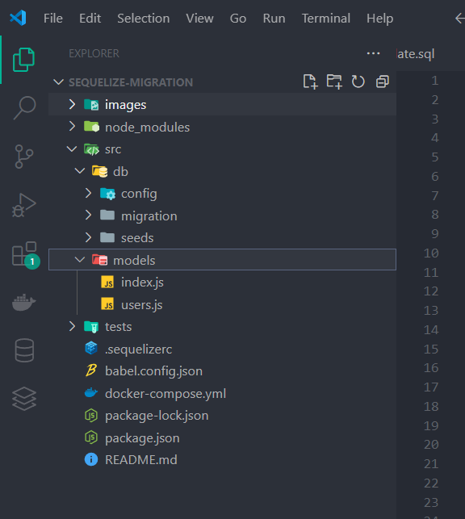
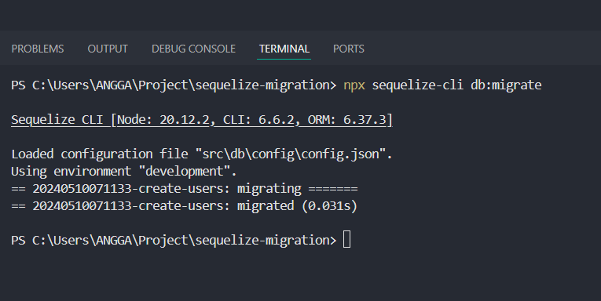
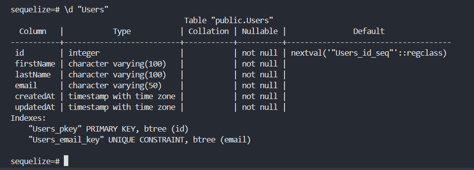
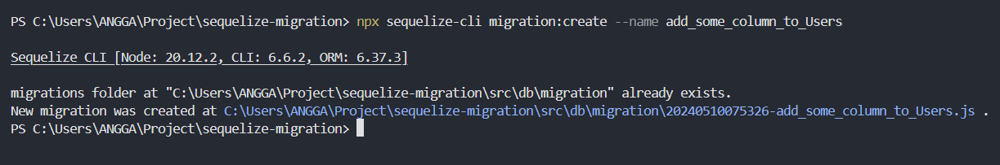
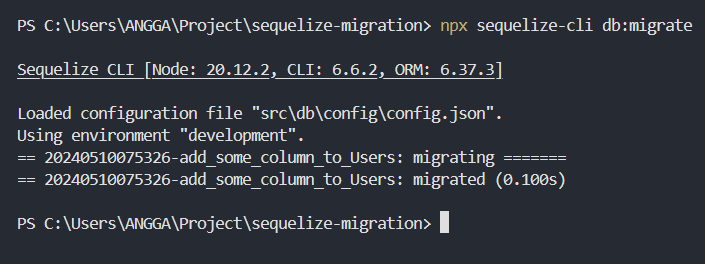

# Db migration
Database migration adalah sebuh fitur yang mirip seperti VCS(Version Control System) untuk merekam/traking perubahan perubahn struktur tabel pada database. Dengan adanya database migration ini memungkinkan kita untuk melakukan commit peribahan struktur tabel atau melakukan rollback struktur tabel pada database.  
  
Unutuk menggunakan fitur Database Migration Pasa sequelize kita bisa menggunakan `sequelize-cli`
## install sequelize-cli
``` shell
npx install sequelize-cli --save-dev
```

## Melakukan inisiasi migration
``` shell
npx sequelize-cli init
```

Ketika menjalankan command diatas maka sequelize-cli akan mengenerate bebrapa folder, yaitu :
- config: utuk menyimpan konfigurasi database(connction, pool, etc)
- migration: untuk menyimpan file migration 
- seeds : untuk menyimpan file seeders

## Mengatur lokasi generate folder
Ketika kita menjakankan command `npx sequelize-cli init` maka folder models, config, seeds, migrations akan di generate di root project kita. Jika kita ingin melakukan perubahan lokasi generate folder tersebut maka kita bisa membuat file `.sequelizerc` untuk merubah lokasi untuk mengenerate folder tersebut.
  
Perlu diingat bahwa untuk merubah lokasi generate folder tersebut kita membutuhkan dependency `babel-register`
``` shell
npm install babel-register --save-dev
```
Berikut ini merupakan code cara untuk merubah lokasi genere folder tersebut :
``` js
require('babel-register');
const path = require('path');

module.exports = {
  // menyimpan file configuration pada ./src/db/config/config.json
  config: path.resolve('./src/db/config/', 'config.json'),
  'models-path': path.resolve('./src/models'),
  'seeders-path': path.resolve('./src/db/seeds'),
  'migrations-path': path.resolve('./src/db/migration'),
};
```
## Config Sequelize
Sebelum kita melakukan migration kita harus melakukan konfigurasi password, username, coonection pool dan sebagainya pada sequelize kita bisa lakukan pada file `config.json` yang telah digeneratekan sebelumnya
``` json
{
  "development": {
    "username": "alliano-dev",
    "password": "test_pass",
    "database": "sequelize",
    "host": "127.0.0.1",
    "dialect": "postgres",
    "port": 5432,
     "pool": {
      "max": 10,
      "min": 5,
      "acquire": 30000,
      "idle": 10000 
    }
  },
  "test": {
    "username": "root",
    "password": null,
    "database": "database_test",
    "host": "127.0.0.1",
    "dialect": "mysql"
  },
  "production": {
    "username": "root",
    "password": null,
    "database": "database_production",
    "host": "127.0.0.1",
    "dialect": "mysql"
  }
}
```
## Membuat model migration
Untuk membuat model migrstion pada sequelze kita bisa menggunakan command :
``` shell
npx sequelize-cli model:generate --name Users --attributes firstName:string,lastName:string,email:string,password
```

Sayang nya pada sequelize untuk melakukan generate model dan migration membutuhkan parameter `--attributes` untuk untuk mendefine kolom-kolom atau filed pada tabel atau model.  
  
Seperti yang kita ketahi ketika kita ingin membuat model yang memiliki banyak field/kolom tentunya sangat ribet jika menggunakan CLI maka dari itu disini saya memnberi solusi cara mengatasi masalah tersebut dengan cara hanya menyebutkan 1 nama field pada argumen `--attributes`
``` shell
npx sequelize-cli model:generate --name Users --attributes firstName:string
```
maka `sequelize-cli` akan mengenerate kan file migration `/migrations/xxxxxxxxxxxx-create-users.js` dan `models/users.js`  

fiel xxxxxxxxxxxxxxxx-create-users.js
``` js
'use strict';

const { DataTypes } = require('sequelize');

/** @type {import('sequelize-cli').Migration} */
module.exports = {
  async up(queryInterface, Sequelize) {
    await queryInterface.createTable('Users', {
      id: {
        allowNull: false,
        autoIncrement: true,
        primaryKey: true,
        type: Sequelize.INTEGER
      },
      firstName: {
        type: Sequelize.STRING(100)
      },
      createdAt: {
        allowNull: false,
        type: Sequelize.DATE
      },
      updatedAt: {
        allowNull: false,
        type: Sequelize.DATE
      }
    });
  },
  async down(queryInterface, Sequelize) {
    await queryInterface.dropTable('Users');
  }
};
```
  
file model users.js
``` js
'use strict';
const {
  Model
} = require('sequelize');
module.exports = (sequelize, DataTypes) => {
  class Users extends Model {
    /**
     * Helper method for defining associations.
     * This method is not a part of Sequelize lifecycle.
     * The `models/index` file will call this method automatically.
     */
    static associate(models) {
      // define association here
    }
  }
  Users.init({
    firstName: DataTypes.STRING
  },{
    sequelize,
    modelName: 'Users',
  });
  return Users;
};
```

Setelah itu kita bisa menambahkan attribut-attribut atau filed atau kolom yang kita inginkan pada kedua file tersebut.

fiel xxxxxxxxxxxxxxxx-create-users.js
``` js
'use strict';

const { DataTypes } = require('sequelize');

/** @type {import('sequelize-cli').Migration} */
module.exports = {
  async up(queryInterface, Sequelize) {
    await queryInterface.createTable('Users', {
      id: {
        allowNull: false,
        autoIncrement: true,
        primaryKey: true,
        type: Sequelize.INTEGER
      },
      firstName: {
        type: Sequelize.STRING(100)
      },
      // tambahakn filed atau sttribute
      lastName: {
        type: Sequelize.STRING(100),
        allowNull: false
      },
      email: {
        type: DataTypes.STRING(50),
        unique: true,
        allowNull: false
      },
      createdAt: {
        allowNull: false,
        type: Sequelize.DATE
      },
      updatedAt: {
        allowNull: false,
        type: Sequelize.DATE
      }
    });
  },
  async down(queryInterface, Sequelize) {
    await queryInterface.dropTable('Users');
  }
};
```
file model users.js
``` js
'use strict';
const {
  Model
} = require('sequelize');
module.exports = (sequelize, DataTypes) => {
  class Users extends Model {
    /**
     * Helper method for defining associations.
     * This method is not a part of Sequelize lifecycle.
     * The `models/index` file will call this method automatically.
     */
    static associate(models) {
      // define association here
    }
  }
  Users.init({
    firstName: DataTypes.STRING(100),
    // tambahakn attribut baru
    lastName: DataTypes.STRING(100),
    email: {
      type: DataTypes.STRING(50),
      unique: true,
      allowNull: false
    }
  },{
    sequelize,
    modelName: 'Users',
  });
  return Users;
};
```

struktur folder


## Sysncronize Table
Selama ini ketika kita hanya membuat file migration dan modelnya saja, untuk melakukan syncronize ke dalam database(membuat tabel berdasarkan file migration) maka kita harus menjalankan perintah 
``` shell
npx sequelize-cli db:migrate
```

Dengan demikian maka model Users yang telah kita define pada file migration akan di mapping menjadi table didalam database



## Tanble History
Perlu diketahui Sequelize menyimpan rekaman database kita pada tabel `SequelizeMeta` semua perubahan yang trjadi pada struktur tabel akan disipan pada tabel tersebut.

## RollBack Table
Ketika kita mungkin ingin membatalkan membuat tabel maka kita bisa memanfaatkan command 
``` shell
npx sequelize-cli db:migrate:undo:all
```
Saat kita menjalankan command diatas maka Sequalize akan melakukan lookup pada Tabel `SequelizeMeta` dan setelah itu Sequelize akan mengembalikan struktur tabel ke struktur tabel sebelumnya berdasasrkan history yang disimpan pada `SequelizeMeta`

## Alter Tabele
Terkadang kita ingin melakukan perubahan struktur tabel yang telah kita buat misalnua kita ingin menambahkan kolom baru atau menghapus kolom baru ataupun kita ingin menambahkan constraint.  
  
Haltersebut dapat kita lakukan dengan sequelize dengan memanfatkan perintah migration. Untuk melakukan hal tersebut pertama-tama kita harus membuat file migration dengan perintah 
``` shell
npx sequelize-cli migration:create --name add_some_column_to_Users
```

  
Setelah menjalankan command diatas maka kita akan digeneratekan sebuh file migration baru pada folder /migration
``` js
'use strict';

/** @type {import('sequelize-cli').Migration} */
module.exports = {
  async up (queryInterface, Sequelize) {
    /**
     * Add altering commands here.
     *
     * Example:
     * await queryInterface.createTable('users', { id: Sequelize.INTEGER });
     */
  },

  async down (queryInterface, Sequelize) {
    /**
     * Add reverting commands here.
     *
     * Example:
     * await queryInterface.dropTable('users');
     */
  }
};
```
NOTE :
> Perhatikan method `up()` dan `down()`  
method up digunakan unutuk menyimpan logic-logic untuk melakukan perubahan pada struktur tabel dan method down digunakan untuk menyimpan logic-logic untuk melakukan rollback.
  
``` js
'use strict';

const { DataTypes } = require('sequelize');

/** @type {import('sequelize-cli').Migration} */
module.exports = {
  /**
   * 
   * @param {*} queryInterface 
   * queryInterface adalah sebuh object yang dapat kita gunakan utuk berkomunukasi
   * dengan databe secara dialec-agnostic
   * @param {*} Sequelize 
   * @returns 
   */
  async up (queryInterface, Sequelize) {
    /**
     * disini kita bisa memanfaatkan parameter queryInterface 
     * untuk berkomunikasi dengan database, dengan menggunakan
     * queryInterface ini kita bisa melakukan altertabel dan sebagainya
     */
    return Promise.all([
      queryInterface.addColumn("Users", "password", {
        type: DataTypes.STRING,
        allwoNull: false
      }),
      queryInterface.addColumn("Users", "gendre", {
        type: DataTypes.ENUM,
        values: ["male", "female"],
        allwoNull: false
      })
    ])
  },

  async down (queryInterface, Sequelize) {
    // logic untuk melakukan rollback
    return Promise.all([
      queryInterface.removeColumn("Users", "password"),
      queryInterface.removeColumn("Users", "gendre")
    ])
  }
};
```

Jagan lupa setel kita membuat logic method up dan down kita juga perlu mengupdate model nya
``` js
'use strict';
const {
  Model
} = require('sequelize');
module.exports = (sequelize, DataTypes) => {
  class Users extends Model {
    /**
     * Helper method for defining associations.
     * This method is not a part of Sequelize lifecycle.
     * The `models/index` file will call this method automatically.
     */
    static associate(models) {
      // define association here
    }
  }
  Users.init({
    firstName: {
      type: DataTypes.STRING,
      allowNull: false
    },
    lastName: DataTypes.STRING,
    email: {
      type: DataTypes.STRING,
      unique: true,
      allowNull: false
    },
    // tambahkan attribut sesuai dengan yang ditambahkan pada file migration
    password: {
      type: DataTypes.STRING,
      allowNull: false
    },
    gendre: {
      type: DataTypes.ENUM,
      values: ["male", "female"],
      allowNull: false
    }
  }, {
    sequelize,
    modelName: 'Users',
  });
  return Users;
};
```

setelah itu kita bisa menjalankan perintah
``` shell
npx sequelize-cli db:migrate
```


